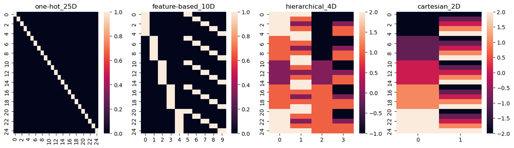

# Preparation for RSA analysis
## Activity pattern
To run multivariate analysis, we need to get the activity pattern matrix. To achieve that, we adopted the ['LS-A' approach](https://doi.org/10.1016/j.neuroimage.2011.08.076).
### 1. the LS-A approach
For each participant, we build first level GLMs with 25 regressors (one for each stimuli) in each session (run), this yields a total of 25*4 = 100 condition regressors. Response stage was modeled with a boxcar function with a duration corresponding to participant's actual navigation time in the task. Realignment parameters and their first derivatives are included as nuisance regressors (see [Univariate Analysis Pipeline](/scripts/univariate/UnivariateAnalysisPipeline.md)).  
Then we build the following contrasts:  
(1) a contrast for each of the stimuli, this yields 25 contrasts  
We extracted the 25 stimuli contrast to constructs a $N_{stimuli}\times N_{voxels}$ activity pattern matrix for visualization.

(2) a contrast for each of the stimuli in odd/even runs, this yields 25*2 = 50 contrasts  
We extracted the 50 stimuli contrasts separating odd and even runs to construct two $N_{stimuli}\times N_{voxels}$ activity pattern matrices for calculating reliability map and running RSA.

### 2. activity pattern 4D nii files
Then three 4D nii files are created by combining the following three groups of images together:  
(1) a `stimuli_4r.nii` file created from 100 beta_\*\*\*\*.nii files, each representing the beta estimates of one stimulus in one run. In the combined 4D nii file, the volumes are ordered according to:  
stim00run1, stim01run1, ..., stim00run2, stim01run2, ..., stim00run4, ..., stim24run4  
(2) a `stimuli_oe.nii` file created from 50 con_\*\*\*\*.nii files, each representing the contrast estimates of one stimulus in odd/even run. In the combined 4D nii file, the volumes are ordered according to:  
stim00odd, stim01odd, ..., stim24odd, stim00even, stim01even, ...  stim24even  
(3) a `stimuli_mu.nii` file created from 25 con_\*\*\*\*.nii files, each representing the contrast estimates of one stimulus across all runs. In the combined 4D nii file, the volumes are ordered according to:  
stim00, stim01, ..., stim24

### 3. Reliability Map calculation
Using a [split-half approach](https://doi.org/10.1016/j.neuroimage.2019.116350), we calculate the reliability map for each participant.
Let $M1$ and $M2$ be the $N_{stimuli}\times N_{voxels}$ activity pattern matrices for the odd and even runs respectively. Then $M1_{i}$ and $M2_{i}$ (column $i$ in $M1$ and $M2$) defines the response profile of voxel $i$ in odd and even runs. Reliability is defined as the stability of the response profile, i.e., the reliability of a given voxel $i$ is computed by  
$$R_{i} = Spearman's r(M1_{i},M2_{i})$$ 
A nifti file of the reliability map is saved in the first level directory of the participants. Then a threshold of 0 is applied to binarize the map into a reliability mask which specifies the reliable voxels.
This is implemented in the [`create_reliability_mask.py`](/scripts/multivariate/create_reliability_mask.py)

# Different types of RSA Analysis
Several types of RSA analysis are designed to test the representation geometry. Analyses are performed via different class of [`Estimators`](/scripts/multivariate/rsa_estimator.py)
## Neural Vector Analysis
Let $𝑓_𝑗$ be the coordinate of stimuli $j$ in neural representation space $ℝ^𝑚$ ($m$ being the number of voxels). For any two stimuli $𝑗,𝑘$, we define the neural vector (coding direction) from $𝑗$ to $𝑘$ as:  
$$𝑣_{𝑗𝑘}=𝑓_𝑗− 𝑓_𝑘$$
For any given pair of neural vectors, we can compute its cosine similarity as an indicator of how parallel these two neural vectors are
$$cos⁡(𝑣_1, 𝑣_2)=  \frac{𝑣_1 \times 𝑣_2}{\left\Vert 𝑣_1 \right\Vert \times \left\Vert 𝑣_2 \right\Vert}$$
If we replace $𝑓_𝑗$ and $𝑓_𝑘$ with the feature vector from the three models of representation (row vector from the feature matrices), we can compute the theoretical cosine similarity of any given pair of coding directions, and compare that with our data.  

### Direction pair types
If we plot the groundtruth map of stimuli (based on groundtruth x/y locations), we can define different coding direction pairs. In this analysis, we focused on four types of direction pairs:
- **between X**: cosine similarity between two vertical coding directions that
  1) start from the same y
  2) end at the same y
  3) locate in different x columns
- **between Y**: cosine similarity between two horizontal coding directions that
  1) start from the same x
  2) end at the same x
  3) locate in different y rows
- **within X**: cosine similarity between two vertical coding directions that
  1) locate within the same x column
- **within Y**: cosine similarity between two horizontal coding directions that
  1) locate within the same y row

  

Similarly, we can use a feature-based groundtruth map, disregarding which feature maps onto x and which feature maps onto y, to derive the above direction types.
### Predicted Cosine Similarity of different models of representation
#### highDim-25
Under the assumption of highDim-25 model, there are three possible values of cosine similarity between any given pair of coding directions: $0.5$, $0$, $-0.5$.
When the pair of coding directions intersect at the starting location or ending location, its  cosine similarity is $0.5$ or $-0.5$. When the pair do not share starting or ending location, its cosine similarity is 0. To better understand why this is the case, here is an illustration that represent 4 stimuli using one hot coding. The locations of these 4 stimuli in this representation space form a tetrahedron.

Coming back to the 25 stimuli in our experiment, in the within X/Y case, each X column/Y row has 5 stimuli, which yields ${5\choose2} = 10$ coding directions. These $10$ coding directions constitutes ${10\choose2} = 45$ pairs of coding directions to compute cosine similarity measures on. Among all $45$ pairs of coding directions, there are: 
 - $\left[{4\choose2} + {3\choose2} + {2\choose2}\right]*2 = 20$ pairs of stimuli that share the same starting/ending locations
 - $3+2+1+2+1+1 = 10$ pairs of stimuli that starting location of one of the coding direction is the ending location of the other
 - $15$ pairs of stimuli that do not share the same starting/ending locations  

Therefore, 
- the average cosine similarity of within X/Y pairs is ${{20\times0.5+10\times(-0.5)}\over 45} = {5\over45} = {1\over9} = 0.111111$...

For between X/Y pairs, the coding directions in any pair never cross with each other. Hence, 
- the cosine similarity of between X/Y pairs will always be $0$

#### highDim-10
This model assumes that the representations factorise color and shape, but each color/shape is still represented using one-hot coding. Thus, between X/Y pairs should be parallel, but within X/Y would show similar result as the highDim-25 model. In sum, for this model,
- the average cosine similarity of within X/Y pairs is $0.111111...$ 
- the average cosine similarity of between X/Y pairs is $0$ 
  
#### lowDim-2
This model assumes that not only the representations factorise color and shape, but also project color/shape onto x/y axis respectively. Thus, between X/Y pairs as well as within X/Y pairs should all be parallel,
- the average cosine similarity of within X/Y pairs is $0$ 
- the average cosine similarity of between X/Y pairs is $0$ 

Similarly, we can calculate the theoretical prediction of these models using a feature-based groundtruth map for classifying direction pairs. Together we can arrive at the following predictions:  

 

## Correlation / Regression Analysis on neural and model RDM
### Neural RDM
activity pattern within each mask/sphere is extracted to compute the neural RDM. If voxel selection is performed, then the spherical region will only include the selected voxels to compute neural RDM.   
Some choices need to be made before calculating neural RDM: 
1) Centering
   - No centering: this is the one we are currently using
   - cocktail blank removal: subtract mean activity pattern, centering is performed for each voxel (each column of the activity pattern matrix) separately.
   - demean: subtract mean activity value, centering is performed for each condition (each row of the activity pattern matrix) separately.
1) Distance metrics
   - Euclidean
   - Correlation: this is the one we are currently using
   - Mahalanobis distance 
 
### Quantifying similarity between neural RDM and model RDM
Only the lower triangular part of the model RDMs and neural RDMs (excluding diagonals) are extracted for the analysis
(1) regression
regression uses one or a set of model RDMs to predict neural RDM. Dependent variable and predictors are standardized (separately) before entering the regression analysis.
(2) correlation
Spearman's rank correlation is computed between the neural RDM and one model RDM. the correlation coefficient is Fisher z-transformed before entering second level analysis
# Running RSA Analysis
## Regions
### 1. Brain parcellation based RSA: obtaining ROI masks from AAL parcellation
AAL3v1 parcellation is used to generate anatomical masks for ROIs. The procedure was carried out in marsbar. Each anatomical masks is a binarize and resampled to match the resolution of the participants' functional images.  
Details on what parcellation is included in each anatomical mask are in [`anatomical_masks.json`](/scripts/anatomical_masks.json). This is read in by [`anatomical_masks.m`](/scripts/anatomical_masks.m) to generate the mask file in nii format. 

### 2. Whole brain searchlight RSA: obtaining spherical searchlight regions
For each voxel, a spherical ROI is defined with a radius of 10mm (4 times the voxel size). An additional constraint is added: each searchlight sphere should include at least 50 usable voxels. 

## Statistical tests
### Parametric tests
For ROI-based analysis one sample t-test is performed on the metric
For whole-brain searchlight analysis, for a given predictor, a metric map is generated for each participant. This is then entered into SPM's second level analysis to perform statistic test (one-sample t-test) and multiple correction.
### Non-parametric tests with permutation test
TBC
non parametric test do not assume distribution of the metric, and maybe a more exact test for the effect. We can shuffle the activity pattern matrix and generate null distribution of the metric and compare our estimated value to this null distribution.